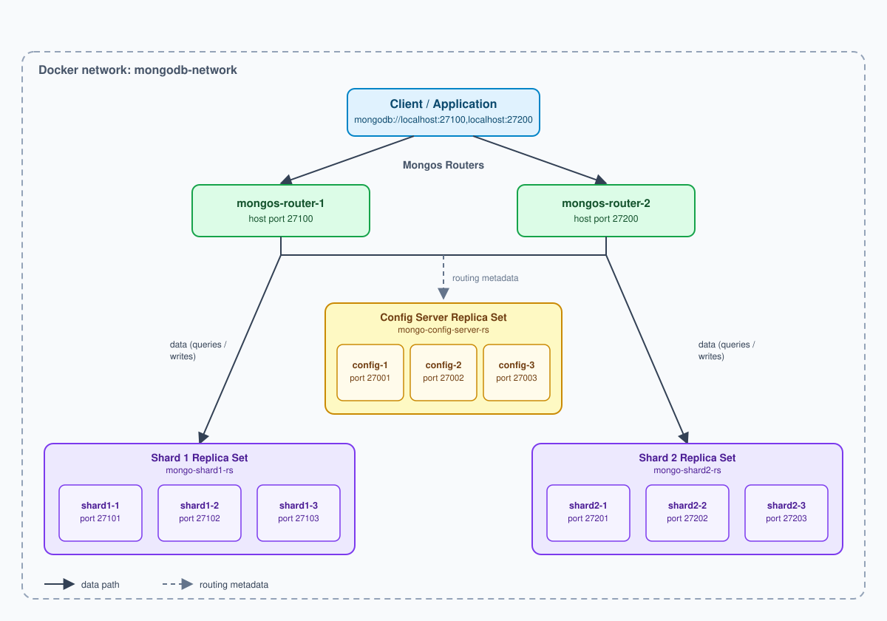

# MongoDB Sharded Cluster Setup (Docker)

MongoDB here is just one high-level storage option for the Inverted Index
Storage and Database components — a way to get replication and horizontal
scaling without building it by hand. Underneath, any such option still
resolves to structures persisted at the disk level; this doc covers setting
one up so that layer doesn't have to be reasoned about at the application
level.

**Goal:** build a MongoDB Sharded Cluster to support horizontal scaling and
high availability for the Inverted Index Storage / Database components.

## Quick start (Docker Compose)

The topology below is captured as a [`docker-compose.yml`](../docker-compose.yml)
at the repo root, so the 11 containers don't need to be started by hand:

```bash
docker compose up -d
./init-cluster.sh
```

`docker compose up -d` starts all containers on the `mongodb-network`.
[`init-cluster.sh`](../init-cluster.sh) then runs the one-time
`rs.initiate(...)` calls for each replica set and `sh.addShard(...)` to
register both shards with the router — steps compose itself can't express,
since they're commands run *inside* already-running mongod/mongos processes,
not container startup config.

The manual steps below show what that script and compose file are doing
under the hood, container by container.

## Target topology



```
MongoDB Sharded Cluster
├── Config Servers (Replica Set: mongo-config-server-rs)
│   ├── mongo-config-server-1:27017 (host port 27001)
│   ├── mongo-config-server-2:27017 (host port 27002)
│   └── mongo-config-server-3:27017 (host port 27003)
├── Shard 1 (Replica Set: mongo-shard1-rs)
│   ├── mongo-shard1-1:27017 (host port 27101)
│   ├── mongo-shard1-2:27017 (host port 27102)
│   └── mongo-shard1-3:27017 (host port 27103)
├── Shard 2 (Replica Set: mongo-shard2-rs)
│   ├── mongo-shard2-1:27017 (host port 27201)
│   ├── mongo-shard2-2:27017 (host port 27202)
│   └── mongo-shard2-3:27017 (host port 27203)
└── Mongos Routers
    ├── mongos-router-1:27017 (host port 27100)
    └── mongos-router-2:27017 (host port 27200)
```

11 containers total: 3 config servers, 3+3 shard nodes, 2 routers.

## Component reference

Every container is reachable two ways: by its container name from inside
`mongodb-network` (what the containers use to talk to each other), and by
`localhost:<host port>` from the host machine (what you use to `mongosh`
into or `docker exec` a specific node).

| Component | Container name | Replica set | In-network address | Host URL |
|---|---|---|---|---|
| Mongos router | `mongos-router-1` | — | `mongos-router-1:27017` | `mongodb://localhost:27100` |
| Mongos router | `mongos-router-2` | — | `mongos-router-2:27017` | `mongodb://localhost:27200` |
| Config server | `mongo-config-server-1` | `mongo-config-server-rs` | `mongo-config-server-1:27017` | `mongodb://localhost:27001` |
| Config server | `mongo-config-server-2` | `mongo-config-server-rs` | `mongo-config-server-2:27017` | `mongodb://localhost:27002` |
| Config server | `mongo-config-server-3` | `mongo-config-server-rs` | `mongo-config-server-3:27017` | `mongodb://localhost:27003` |
| Shard 1 node | `mongo-shard1-1` | `mongo-shard1-rs` | `mongo-shard1-1:27017` | `mongodb://localhost:27101` |
| Shard 1 node | `mongo-shard1-2` | `mongo-shard1-rs` | `mongo-shard1-2:27017` | `mongodb://localhost:27102` |
| Shard 1 node | `mongo-shard1-3` | `mongo-shard1-rs` | `mongo-shard1-3:27017` | `mongodb://localhost:27103` |
| Shard 2 node | `mongo-shard2-1` | `mongo-shard2-rs` | `mongo-shard2-1:27017` | `mongodb://localhost:27201` |
| Shard 2 node | `mongo-shard2-2` | `mongo-shard2-rs` | `mongo-shard2-2:27017` | `mongodb://localhost:27202` |
| Shard 2 node | `mongo-shard2-3` | `mongo-shard2-rs` | `mongo-shard2-3:27017` | `mongodb://localhost:27203` |

**Application entry point** (goes through both routers, which then fan the
query out to the right shard(s)):

```
mongodb://localhost:27100,localhost:27200
```

## Steps

### 1. Create a Docker network

So the containers can reach each other by name:

```bash
docker network create mongodb-network
```

### 2. Start the shard servers

**Shard 1 — 3 nodes:**

```bash
# Shard 1 - Node 1
docker run -d -p 27101:27017 --name mongo-shard1-1 --network mongodb-network \
  mongo:5 mongod --shardsvr --replSet mongo-shard1-rs --port 27017 \
  --bind_ip localhost,mongo-shard1-1

# Shard 1 - Node 2
docker run -d -p 27102:27017 --name mongo-shard1-2 --network mongodb-network \
  mongo:5 mongod --shardsvr --replSet mongo-shard1-rs --port 27017 \
  --bind_ip localhost,mongo-shard1-2

# Shard 1 - Node 3
docker run -d -p 27103:27017 --name mongo-shard1-3 --network mongodb-network \
  mongo:5 mongod --shardsvr --replSet mongo-shard1-rs --port 27017 \
  --bind_ip localhost,mongo-shard1-3
```

**Shard 2 — 3 nodes:**

```bash
# Shard 2 - Node 1
docker run -d -p 27201:27017 --name mongo-shard2-1 --network mongodb-network \
  mongo:5 mongod --shardsvr --replSet mongo-shard2-rs --port 27017 \
  --bind_ip localhost,mongo-shard2-1

# Shard 2 - Node 2
docker run -d -p 27202:27017 --name mongo-shard2-2 --network mongodb-network \
  mongo:5 mongod --shardsvr --replSet mongo-shard2-rs --port 27017 \
  --bind_ip localhost,mongo-shard2-2

# Shard 2 - Node 3
docker run -d -p 27203:27017 --name mongo-shard2-3 --network mongodb-network \
  mongo:5 mongod --shardsvr --replSet mongo-shard2-rs --port 27017 \
  --bind_ip localhost,mongo-shard2-3
```

### 3. Check shard node health

```bash
# Shard 1
docker exec -it mongo-shard1-1 mongosh --port 27017 --eval "db.runCommand({ ping: 1 })"
docker exec -it mongo-shard1-2 mongosh --port 27017 --eval "db.runCommand({ ping: 1 })"
docker exec -it mongo-shard1-3 mongosh --port 27017 --eval "db.runCommand({ ping: 1 })"

# Shard 2
docker exec -it mongo-shard2-1 mongosh --port 27017 --eval "db.runCommand({ ping: 1 })"
docker exec -it mongo-shard2-2 mongosh --port 27017 --eval "db.runCommand({ ping: 1 })"
docker exec -it mongo-shard2-3 mongosh --port 27017 --eval "db.runCommand({ ping: 1 })"
```

### 4. Initiate the replica set for each shard

**Shard 1:**

```bash
docker exec -it mongo-shard1-1 mongosh --eval "rs.initiate({
  _id: 'mongo-shard1-rs',
  members: [
    { _id: 0, host: 'mongo-shard1-1' },
    { _id: 1, host: 'mongo-shard1-2' },
    { _id: 2, host: 'mongo-shard1-3' }
  ]
})"
```

**Shard 2:**

```bash
docker exec -it mongo-shard2-1 mongosh --eval "rs.initiate({
  _id: 'mongo-shard2-rs',
  members: [
    { _id: 0, host: 'mongo-shard2-1' },
    { _id: 1, host: 'mongo-shard2-2' },
    { _id: 2, host: 'mongo-shard2-3' }
  ]
})"
```

### 5. Check replica set status

```bash
# Shard 1
docker exec -it mongo-shard1-1 mongosh --eval "rs.status()"
docker exec -it mongo-shard1-2 mongosh --eval "rs.status()"

# Shard 2
docker exec -it mongo-shard2-1 mongosh --eval "rs.status()"
docker exec -it mongo-shard2-2 mongosh --eval "rs.status()"
```

### 6. Start the config servers

```bash
# Config Server 1
docker run -dit --name mongo-config-server-1 --net mongodb-network -p 27001:27017 \
  mongo:5 --configsvr --replSet mongo-config-server-rs --port 27017 \
  --bind_ip localhost,mongo-config-server-1

# Config Server 2
docker run -dit --name mongo-config-server-2 --net mongodb-network -p 27002:27017 \
  mongo:5 --configsvr --replSet mongo-config-server-rs --port 27017 \
  --bind_ip localhost,mongo-config-server-2

# Config Server 3
docker run -dit --name mongo-config-server-3 --net mongodb-network -p 27003:27017 \
  mongo:5 --configsvr --replSet mongo-config-server-rs --port 27017 \
  --bind_ip localhost,mongo-config-server-3
```

### 7. Check config server health

```bash
docker exec -it mongo-config-server-1 mongosh --port 27017 --eval "db.runCommand({ ping: 1 })"
docker exec -it mongo-config-server-2 mongosh --port 27017 --eval "db.runCommand({ ping: 1 })"
docker exec -it mongo-config-server-3 mongosh --port 27017 --eval "db.runCommand({ ping: 1 })"
```

### 8. Initiate the config server replica set

```bash
docker exec -it mongo-config-server-1 mongosh --port 27017 --eval "rs.initiate({
  _id: 'mongo-config-server-rs',
  members: [
    { _id: 0, host: 'mongo-config-server-1' },
    { _id: 1, host: 'mongo-config-server-2' },
    { _id: 2, host: 'mongo-config-server-3' }
  ]
})"
```

### 9. Check config server replica set status

```bash
docker exec -it mongo-config-server-1 mongosh --port 27017 --eval "rs.status()"
```

### 10. Start the mongos routers

```bash
# Mongos Router 1
docker run -dit --name mongos-router-1 --net mongodb-network -p 27100:27017 \
  mongo:5 mongos --configdb mongo-config-server-rs/mongo-config-server-1:27017,mongo-config-server-2:27017,mongo-config-server-3:27017 \
  --port 27017 --bind_ip localhost,mongos-router-1

# Mongos Router 2
docker run -dit --name mongos-router-2 --net mongodb-network -p 27200:27017 \
  mongo:5 mongos --configdb mongo-config-server-rs/mongo-config-server-1:27017,mongo-config-server-2:27017,mongo-config-server-3:27017 \
  --port 27017 --bind_ip localhost,mongos-router-2
```

### 11. Check the mongos routers

```bash
docker exec -it mongos-router-1 mongosh --port 27017 --eval "db.runCommand({ ping: 1 })"
docker exec -it mongos-router-2 mongosh --port 27017 --eval "db.runCommand({ ping: 1 })"
```

### 12. Add the shards to the cluster

```bash
docker exec -it mongos-router-1 mongosh --eval "sh.addShard('mongo-shard1-rs/mongo-shard1-1:27017,mongo-shard1-2:27017,mongo-shard1-3:27017')"

docker exec -it mongos-router-1 mongosh --eval "sh.addShard('mongo-shard2-rs/mongo-shard2-1:27017,mongo-shard2-2:27017,mongo-shard2-3:27017')"
```

### 13. Verify the cluster

```bash
docker exec -it mongos-router-1 mongosh --eval "sh.status()"
docker exec -it mongos-router-1 mongosh --eval "db.adminCommand('listShards')"
```

### 14. Connection string

Applications connect to the cluster through:

```
mongodb://localhost:27100,localhost:27200
```

## Result

- 2 shards, each a 3-node replica set.
- 1 replica set for the config server, with 3 nodes.
- 2 mongos routers for load balancing.
- Cluster runs stably in Docker on an isolated network, reachable at
  `mongodb://localhost:27100,localhost:27200`.
